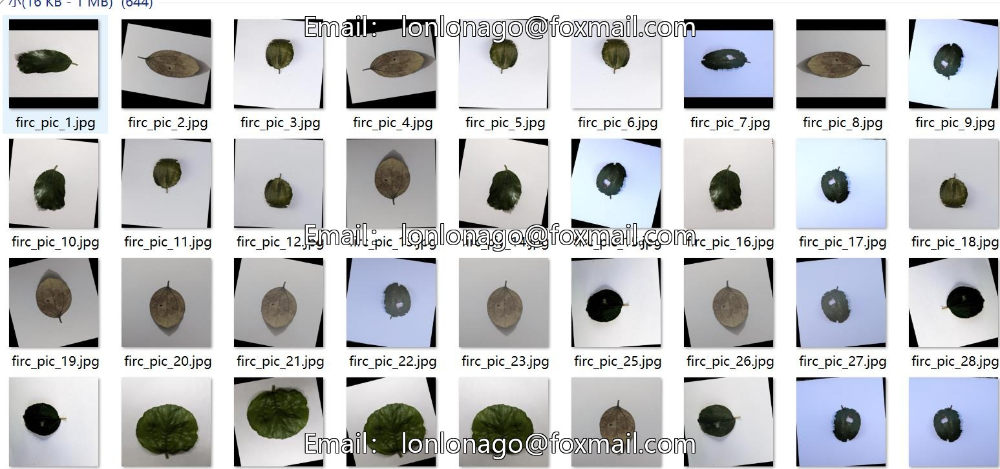
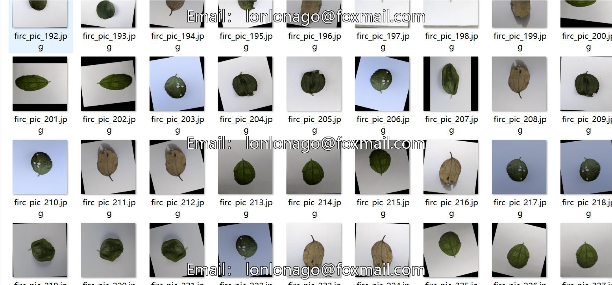
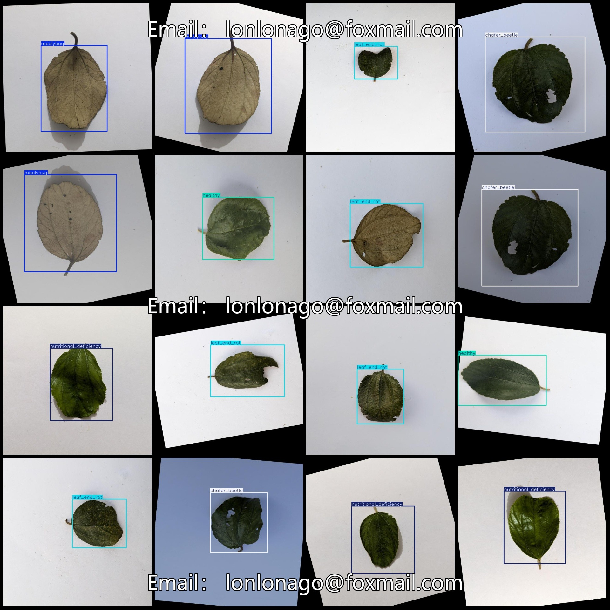
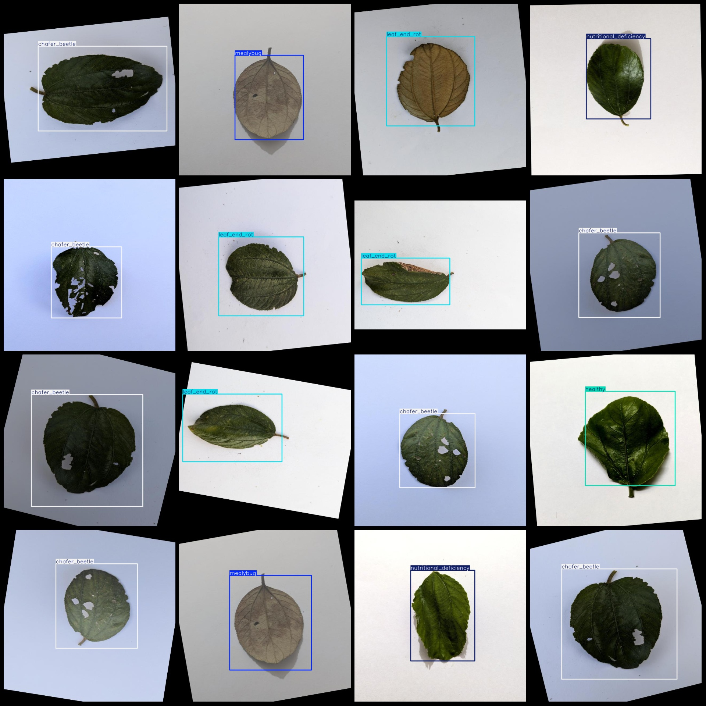

# Medical Image Dataset for Disease Detection in Jujube Leaves with VOC+YOLO Format and Enhanced 649 Images in 5 Categories

Please note that there are a large number of enhanced images in the dataset, mainly rotation enhancements. The leaves are all placed on white paper as individual leaves.

The dataset format is Pascal VOC format+YOLO format. It does not include the split path in the txtfile, only the jpgimage and corresponding VOC format xmlfile and yolo format txtfile.

number of images: 649

The number of XML files is 649.

Annotation count is 649.

The number of categories is 5.

The labeled categories are: ["chafer beetle", "healthy", "leaf end rot", "mealybug", "nutritional deficiency"].

Number of bounding boxes per category:

The number of frames in the Chafer Beetle (golden beetle) frame is 130.

Healthy frame count = 130

Leaf End Rot/Tip Yellowing Box Count = 136

Mealybug (Box Count) = 125

Nutritional deficiency (nutritional deficiency) box count = 128

Total frames: 649

Number of images per category:

The number of images for the "chafer beetle" (golden ant) is 130.

The number of images containing the word "healthy" is 130.

Leaf End Rot (Leaf Tip Blight) images = 136

The mealybug (aphids) have 125 images.

The nutritional_deficiency function takes in the argument "images" and returns a value of 128.

Image resolution: 640x640

Use annotation tool: labelImg

Annotation rule: Draw a square frame around the class.

Important Notice: The dataset does not have separate training validation test sets.

This dataset does not guarantee the accuracy of the trained model or weights file.

Image preview:
## Image

Here is a pay link on Stripe ( https://buy.stripe.com/3cs8yP7sY87d0vu9AB ). Please contact me lonlonago@foxmail.com after funding $89, and I will send you a complete data files , thank you!

